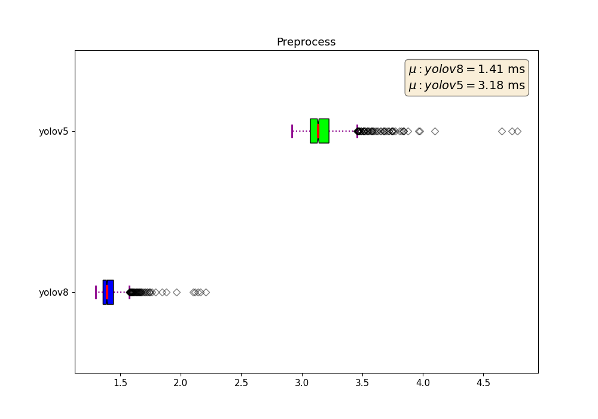
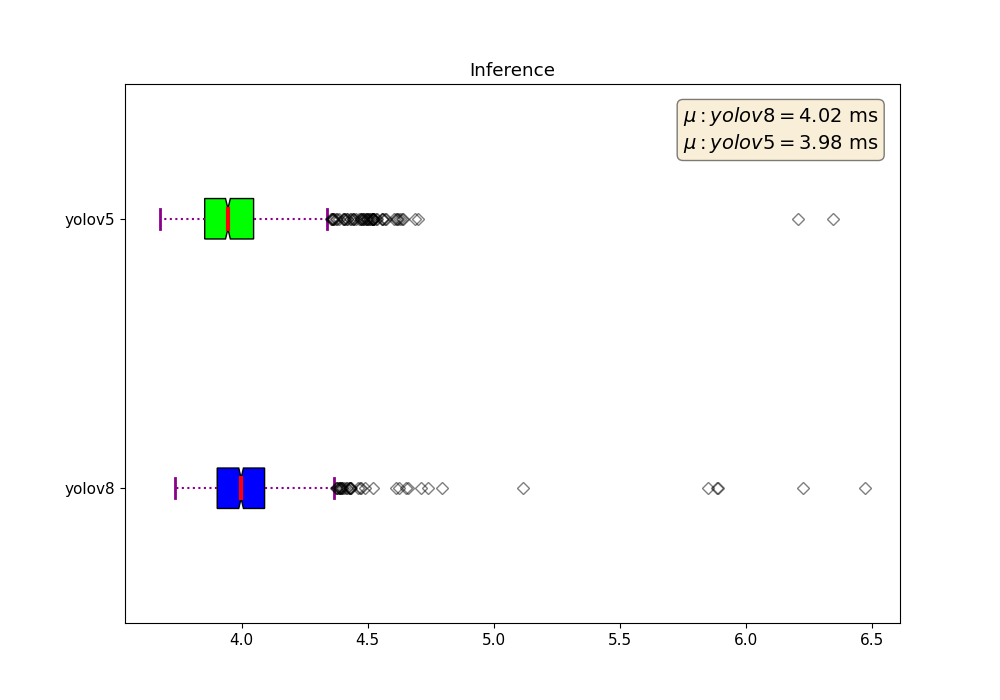
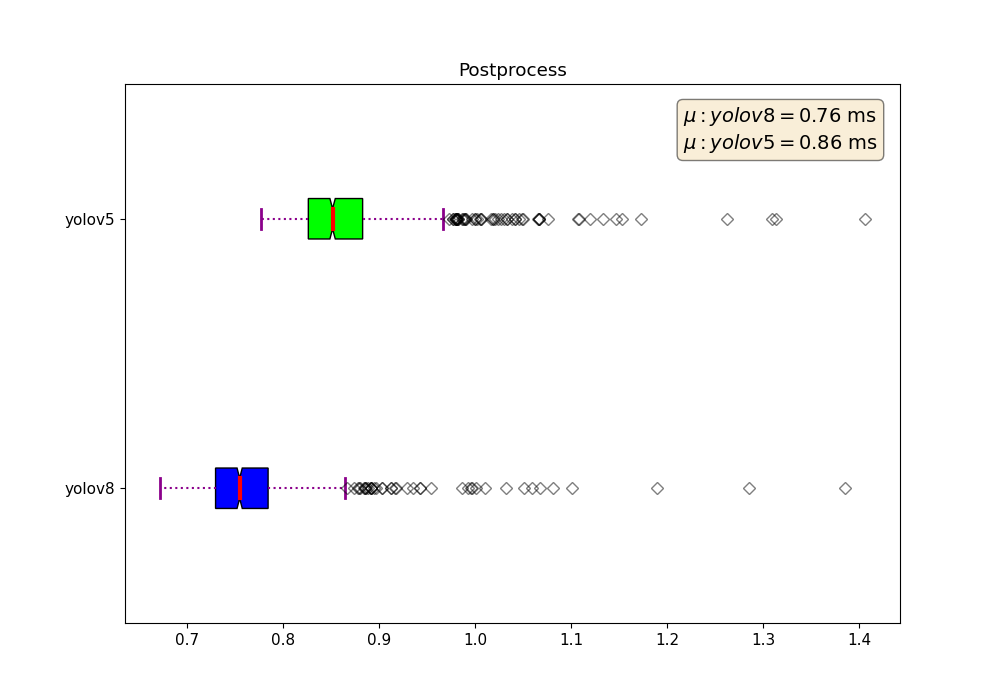
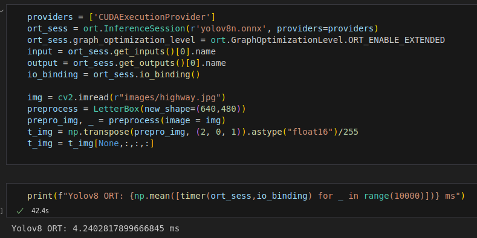
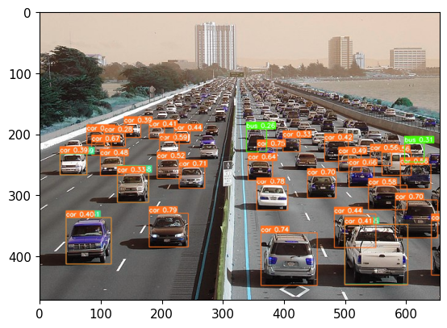

# Production Challenge
Pipeline example for optimization and deployment of an object detector model.

Table of contents
-----------------
* [Model Comparison](#comparison)    
* [Optimization](#optimization)
* [ObjectDetector](#detector)
* [VideoProcessor](#video)

<a name="comparison"></a>
Model Comparison
------------
For the first step I will be comparing two models from the yolo series. For a fair comparison, both models come from a familiar library, Ultralytics. By choosing a similar framework the statistics and metrics will be fair, also taking into consideration the parameters and input size.

- Models:
    - [Yolov8](https://github.com/ultralytics/ultralytics)
    - [Yolov5](https://github.com/ultralytics/yolov5)
- Size (Parameters):
    - Yolov8 Nano: 3.2 M
    - Yolov5 Nano: 1.9 M
- FLOPs
    - Yolov8 Nano: 8.7 B
    - Yolov5 Nano: 4.5 B
- Input size (WxH)
    - 640x480
- Plot
    - 

For testing we will focus not only on the inference time, but also the preprocessing and postprocessing. We have to consider these steps as they are all part of the pipeline. Both models use the same input size and image. For leveraging the profiling task, ultralytics delivers metadata from the pipeline, so we will extract these processes. Alternatively, you can use [line_profiler](https://github.com/pyutils/line_profiler), this is what I typically use but it requieres extracting just the necessary pipeline from pre-defined workflows.

- Preprocess
    - 
- Inference
    - 
- Postprocess
    - 
- Conclusion
    - Yolov8 total mean time: 6.19 ms
    - Yolov5 total mean time: 8.02 ms
    - Yolov8 might be a bit larger, but its preprocessing is significantly faster than yolov5, with a similar inference time and also slightly faster postprocessing. 
    - **Winner: YOLOV8**

<a name="optimization"></a>
Model Optimization
------------
For the model optimization, the first approach will be using onnx.
- Onnx params:
    - Img size: (640,480)
    - Half (fp16): True
    - Simplify: True
    - Device: Gpu
- Results: ONNX Runtime
    - 
    - Onnx optimization and runtime did not helped the model :(, it maintained somewhat pytorchs inference time, this could be because Ultralytics does optimization using script before inference.

Let now try with TensorRT, utilizing the same parameters as onnx.

```shell
$ python3 onnx_to_tensorrt.py -m yolov8n
```
```python
def trt_timer(f,*args):   
    start = perf_counter()
    f.infer(*args)
    return (1000 * (perf_counter() - start))

print(f"Yolov8 TRT: {np.mean([trt_timer(trt_infer,t_img) for _ in range(10000)])} ms")
```
- Output: Yolov8 TRT: 2.392428541831032 ms
- Conclusion: TensorRT optimization takes only 60% of the time compared to pytorch. In other words, its **166%** faster!

<a name="detector"></a>
Object Detector
------------
The abstract class template has three main functionalities:

- Loading the weights and creating the model 
- Setting the labels for filtering 
- Predict method for inference

```python
class ObjectDetector(ABC):
    def __init__(self, model_path, classes) -> None:
        self.model_path = model_path
        self.classes = classes
        
    @abstractmethod
    def predict(self):
        pass

class YoloTRT(ObjectDetector):
    def __init__(self, model_path, classes) -> None:
        super().__init__(model_path, classes)
        self.model = TensorRTInfer(self.model_path)
    
    def predict(self, batch):
        return self.model.infer(batch) 
```

Now lets validate that the detector class is working with dynamic batching for the next step.

```python
from YoloTrt import YoloTRT
label_map = yolov8_model.model.names
model = YoloTRT('yolov8n-batch.trt', classes=label_map)

results = model.predict(batch)
print(results.shape)
(4, 84, 6300)
```


```python
#Batching with size=4
print(f"Yolov8 TRT: {np.mean([trt_timer(trt_infer,batch) for _ in range(10000)])} ms")
Yolov8 TRT: 8.16570611668958 ms
```

<a name="video"></a>
Video Processor
------------
The VideoProcessor class implements multithreading for video decode, preprocessing, postprocessing, and drawing. The idea is to have a subset of videos running in parallel with multithreading, while the GPU does inference with batches.


- Read Videos
```python
# Video's path
video_path = "/home/angel/computer_vision/production_challenge/videos/challenge_videos"
video_list = natsorted(os.listdir(video_path))
video_list = [os.path.join(video_path, v) for v in video_list]
```
- Detection with filter
```python
subset = model.classes
cls = label_map[int(lbl)]
    label = f'{cls} {conf:.2f}'
    if cls not in subset:
        pass
```
- Results
    - Videos 1-> 4
        - Time Elapsed 36.4 s
        - Frames Processed:  5028
    - Videos 5-> 8
        - Time Elapsed 36.4 s
        - Frames Processed:  5028
    - Videos 9 -> 12
        - Time Elapsed 886.7 s
        - Frames Processed:  130436
    - [Link to demo video](https://youtu.be/6zmuJJnPwxk)

*Note: Reference to base article [Multiple Channel Video Inference in Python](https://abhishekchoudhary-32445.medium.com/multiple-channel-video-inference-in-python-6849bb3d3583)*


